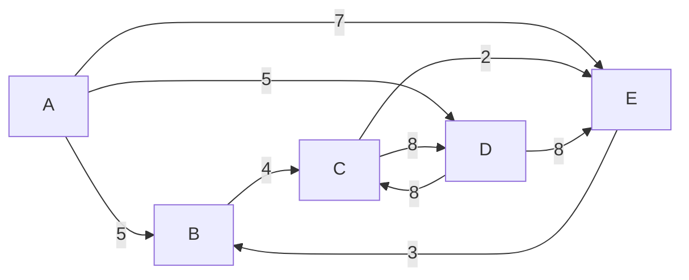

# Ejercicio de rutas de Trenes `java 17`

El objetivo del ejercicio es aplicar procesos para tomar una lista de rutas dadas ( grafos ) y poder `MEDIR` distancias, `RECORRER` rutas, `CONTAR` rutas disponibles Y `SEGUIR` las mejores rutas.

### TEMAS QUÉ SE RESUELVEN
1) La distancia de la ruta A-B-C
2) La distancia de la ruta A-D
3) La distancia de la ruta A-D-C
4) La distancia de la ruta A-E-B-C-D
5) La distancia de la ruta A-E-D
6) El número de viajes que comienzan en C y terminan en C con un máximo de 3 paradas
7) El número de viajes que comienzan en A y terminan en C con exactamente 4 paradas
8) La longitud de la ruta más corta de A a C
9) La longitud de la ruta más corta de B a B
10) El número de rutas diferentes de C a C con una distancia de menos de 30

### ANALISIS INICIAL `AB5,BC4,CD8,DC8,DE6,AD5,CE2,EB3,AE7`





## PAGINA UTILIZADA PARA DIBUJAR LAS RUTAS EN GRAFOS
https://graphonline.ru/es/


## Descargas
Si desea descargar el `.jar` se adjunta el fichero.

- [Descargar back-trains-test-1.0.0](https://telematico-tools.azurewebsites.net/cloud/tests/rutas-de-tren/back-trains-test-1.0.0.jar)


### application.properties
```properties
spring.application.name=back-trains-test
server.port=1902
#logging.level.root=OFF
#logging.level.org.springframework=OFF
# spring.main.banner-mode=off
nodosBase=AB5,BC4,CD8,DC8,DE6,AD5,CE2,EB3,AE7
```

## EJECUTAR POR LINEA DE COMANDO
Para ejecutar por linea de comando un archivo .jar listo para producción debes
seguir 3 pasos: `El .jar fue preparado para solamente ejecutarse y finalizar`

- Descargar el fichero `.jar` [Descargar back-trains-test-1.0.0](https://telematico-tools.azurewebsites.net/cloud/tests/rutas-de-tren/back-trains-test-1.0.0.jar)
- Abrir la consola de su computador
- Aplicar el siguiente comando en la consola `java -jar back-trains-test-1.0.0.jar`

a continuación se adjunta una imagen, donde se muestra el resultado esperado


## EJECUTAR POR MEDIO DE SERVICIO `REST`
`Para realizar estó, necesita descargar el proyecto y ejecutarlo para que pueda levantarse en el purto 1902`
A diferencia de la ejecución anterior, en esté resultado agregamos la ruta de la tratyectoria para cada pregunta.

URL
http://localhost:1902/api/train

## RESPUESTA ESPERADA

```json
{
  "data": {
    "nodes": "AB5,BC4,CD8,DC8,DE6,AD5,CE2,EB3,AE7",
    "connected_nodes": "{A={B=5, D=5, E=7}, B={C=4}, C={D=8, E=2}, D={C=8, E=6}, E={B=3}}",
    "output_1": {
      "path": "[A, B, C]",
      "value": 9
    },
    "output_2": {
      "path": "[A, D]",
      "value": 5
    },
    "output_3": {
      "path": "[A, D, C]",
      "value": 13
    },
    "output_4": {
      "path": "[A, E, B, C, D]",
      "value": 22
    },
    "output_5": {
      "path": "[]",
      "value": "NO SUCH ROUTE"
    },
    "output_6": {
      "path": "[[C, D, C], [C, E, B, C]]",
      "value": 2
    },
    "output_7": {
      "path": "[[A, B, C, D, C], [A, D, C, D, C], [A, D, E, B, C]]",
      "value": 3
    },
    "output_8": {
      "path": "[A, B, C]",
      "value": 9
    },
    "output_9": {
      "path": "[B]",
      "value": 0
    },
    "output_10": {
      "path": "[[A, B, C, D, C, E], [A, B, C, D, E], [A, B, C, E], [A, D, C, D, E], [A, D, C, E], [A, D, E], [A, E]]",
      "value": 7
    }
  },
  "success": true,
  "message": "PROBLEM ONE: TRAINS - SOLVED"
}
```

